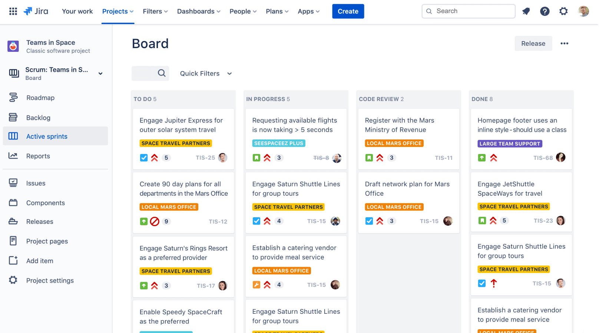

# JIRA 기본 사용법

<br>

## 대체재

* **Mail**

  * 70년대 발명, SMTP 프로토콜 사용

  * 소통을 위해선 또다시 메일을 보내야한다. - 사일로의 주 원인
    * 사일로: 조직 부서간 협력하지 않고 부서간 담을쌓고 내부 이익만을 추구

* **메신저**: 빠른 일 요청 가능하나, 과한 소통으로 본 Task에 집중이 어려워질 수 있다.

<br>

## Jira란?

* 서비스, 프로젝트가 성공하기 위해선 **소통**을 잘해야한다.
* 위의 대체제에서의 문제점을 해결하고 **일, 이슈를 가시화해 실시간 정보 공유**

<br>

### 구조



* **Dashboards**: 과제 or 포괄적인 개요
  * 여러가지 볼수있는 Gadget이 있다. 일이 잘 진행되는지, 과거와 비교할 수 있고 앞으로의 방향을 정하는데 도움이 될 수 있다.
  * Pie chart, Activity Stream, Two dimensional ~~ 등
* Projects: 프로젝트 목록. read 권한 설정 가능
* Issues: 이슈, 필터 검색.
  * 한 이슈 할당시간(스프린트)은 피보나치로 할당해주기. (예상시간에서 올림)
* Boards: 프로젝트에 쌓인 이슈를 보여주는 보드. 기본적으로 프로젝트와 1:1 맵핑

<br>

### workflow

* 팀의 업무 프로세스를 반영한 **흐름**.
* **Transitions**: 워크플로우의 여러 상태 
  * Properties: K-V값으로 커스터마이징
  * Trigger: 외부 시스템에서 Jira시스템에 Hook을 걸어놓는것
  * Conditions: transition 권한 조건
  * Validators: transition 발생 조건
  * post functions: 트랜지션 발생 후 수행할 event

<br>

### Issues

* Epic: 큰 틀. feature 하나. e.g) ~~기능 구현
* Story / Task: 에픽 내부 기능. e.g) ~~ 기능의 일부 서브기능
  * 스토리: 비개발적, 태스크: 개발적인 내용

<br>

#### 이슈 검색

: 이슈가 쌓일수록 보기가 어려워진다.

* **JQL** (Jira query Language): `Field - Operator - Value + Keyword`

  ```
  // 프로젝트명이 TEST이고 할당자가 현재 login 유저인 issue 검색
  Project = "TEST" AND assignee = currentuser()
  
  // 할당자가 나이고, due date 지났는데 처리되지 않은 issue 검색
  Assignee = currentUser() AND status not in (resolved, closed, Done) AND due <= "0"
  ```

* 이슈 권한에 따라 사용자마다 검색결과가 달라질 수 있다.


<br><br>

#### Reference)

#### 카카오 사내 기술학습 - JIRA 사용 기본 가이드

#### https://www.atlassian.com/ko/software/jira