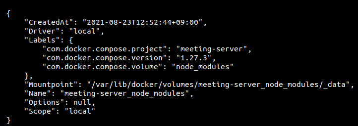

# Docker CLI

<br>

## 기본 CLI

* `docker container inspect {container ID}`
  * 헬스체크 로그?같은걸 볼수있음

* `docker logs {container ID}`

* `sudo dockerd --debug`
  * 데몬 실행 안될때 디버깅

* docker-compose 실행시 `-d` <-- background로 실행
  * 없이 실행하면 실시간 로그를 확인 할 수 있다.

* `--build` : 도커 컨테이너 이미지 생성
  * 이미지는 불변이기 때문에 설정 변경 있을 때 이걸 해줘야 한다.


## 컨테이너 모두 삭제

*  `docker rm $(docker ps -a -q)`
  * 위와 같은 CLI 내부 $(CLI) 와 같은 형태는 내부 ps를 통해 전체에 대해 CLI를 주고자 할 때 좋음.

* `sudo docker system prune --volumes`
  * 로컬에 있는 데이터 볼륨 완전 제거

<br>

## Docker registry에 이미지 업데이트하기

1. 이미지 빌드
   * 컨테이너 띄울 때 이미 빌드 했다면 할 필요 없음

```
docker build . -t {registry 경로}/{무슨 이름으로 올릴지}:{버전 명시}
```

2. 레지스트리에 올리기

```
docker push {registry 경로}/{무슨 이름으로 올릴지}:{버전 명시}
```

<br>

## 컨테이너 상 npm 패키지 이슈

* 로컬에서 `npm install` 를 해줬었는데, 알고보니 직접 컨테이너 안에서 수행했어야 했다.
  * dev환경 compose 설정 확인해보니, `node_modules`를 따로 관리해주고 있었음.
* `node_modules:/root/server/node_modules/` 처럼 맵핑되어있었음

<br>

## 볼륨 관련

* `docker volume ls` : 현재 로컬에 있는 도커 볼륨 확인

* `docker volume inspect ${volume name}` : 아래와같이 mount point 등등 확인 가능

  