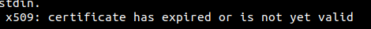
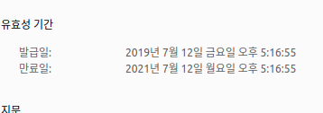

# Issues

 

## 200215

* Docker image 쓸 때 version을 꼭 명시하기
  * Docker hub 참고. docker image는 모두 hub로부터 온다.

 

## 200317

* Docker trouble shooting

  * docker-compose를 down 전에 변경한다면 `has active endpoints` 에러

 

## 200329

* 계속해서 용량이 부족한 문제 발생
  * docker-compose를 새로 실행해 container를 띄울때마다 용량 에러가 발생
  * 매 up 때마다 container에 대한 dummy data가 어마어마하게 쌓여있었다.
  * `sudo docker system prune --volumes` 를 통해 제거

 

## 200412

* dev 변경사항 병합 후 merge 올리자 jenkins error 발생
  * 로그파일 확인하니 `Get https://registry-1.docker.io/v2/: net/http: request canceled while waiting for connection (Client.Timeout exceeded while awaiting headers)`
  * 위의 registry-1.docker.io/v2 링크타고 들어가보니 `{"errors":[{"code":"UNAUTHORIZED","message":"authentication required","detail":null}]}`
  * 인증단계 실패 예상, 구글링 결과
    * 찾아보니 그냥 로그인 문제, 네트워크 문제 등이 많다고 함..
* 해결 : 그냥 다시 해보니까 됨.. 기존과 같은 로그인 정보인데 에러가 발생했으므로 **네트워크 문제**였던 것으로 판단

 

## 200710

* 도커 로그인 $PATH 관련문제 - pass 설정되어있지 않아서 발생한 것
* **gpg**: 암호를 로컬에 저장할 때 암호화해서 저장하기 위한 용도.
  1. docker-credential-pass 다운로드
     * 깃헙 주소로 wget 사용해서 설치해야함
  2. 패키지매니저로 gpg, pass 설치
  3. `gpg --gen-key` 후 유저네임, 이메일 설정
  4. `pass init "바로 위의 유저네임"`
  5. 도커 로그인

 

## 200722

* 도커 로그인시 (혹은 pull 땡겨올 때) 에러

 

* 로컬의 인증서문제인 줄 알았는데 사이트 들어가보니 CA에서 받아온  인증서가 만료된 것..

 

