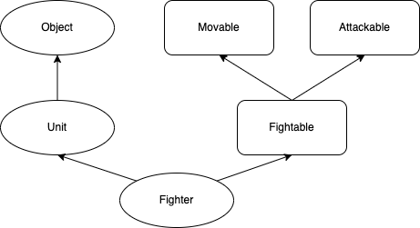

# 자바의정석 - 07장 추상클래스와 인터페이스

## 추상 클래스

: 클래스의 구현부 없는 미완성의 형태. 미완성 설계도

* `abstract` 키워드. **추상클래스**는 모든 메소드가 완성되지 않았다는 뜻이고 **추상메소드**는 구현부가 없다는 뜻이다.
  * 추상 메소드라면 꼭 abstract를 명시해야 추후 휴먼에러를 줄일 수 있다.
* 자식클래스는 부모 클래스의 모든 것을 구현해주어야 한다. 하나라도 구현이 안되면 자식 클래스 역시 추상 클래스여야 한다.
* **추상화**: 여러 클래스들의 공통적인 부분을 뽑아서 **공통의 부모인 추상클래스**로 추상화 <-> 구체화
* 그 자체만으로 인스턴스 생성 불가

<br>

## 인터페이스

: 일종의 추상클래스이지만, **추상화의 정도가 높아서** 몸통을 갖춘 일반 메서드를 멤버로 가질 수 없다.

* 미완성 설계도인 추상 클래스와 비교했을 때, 인터페이스는 밑그림만 그려져있는 기본 설계도.
* **모든 멤버변수**는 `public static final` 이어야 하며 이를 생략 할 수 있다.
* **모든 멤버함수**는 `public abstract` 이어야 하며 이를 생략할 수 있다. (JDK 1.8부터 static, 디폴트 메서드도 가능)
  * 모든 생략사항은 컴파일 시 컴파일러가 추가해준다.
* 인터페이스를 **참조변수의 타입**으로 두고, 다형성을 구현할 수도 있다.

<br>

##### 디폴트 메소드

: 추상 메소드의 기본적인 구현을 제공하는 메소드. 새로운 추상 메소드가 추가될 때, 모든 구현체에서 이걸 구현할 필요는 없다.

<br>

### 다중상속 (extends)

: 일반적으로 자바에서는 다중 상속이 금지되어있다. 그러나 인터페이스의 경우는 다중 상속이 가능하다.

```java
interface Fightable extends Movable, Attackable { }
```

<br>

#### **implements**

: 상속받듯, 인터페이스에서는 **구현(implements)** 키워드을 사용한다.

* 구현하는 인터페이스 중 일부만 구현한다면, `abstract`를 붙여 추상 클래스로 선언해야한다.
* 상속과 구현 동시에도 가능하다.

<br>

### 인터페이스의 장점

* 개발시간 단축: 양쪽에서 사용되는 경우, 인터페이스만 명세해놓고 일단 양쪽에서 작성하면 된다.
* 표준화: 기본 틀을 인터페이스로 작성 -> 정형화된 프로그래밍
* **관계가 없는 클래스**간 관계를 맺어줄 수 있다. 관계가 없으니 상속으로 묶기 애매한 경우, `~~~able`형태의 인터페이스를 구현하는 형태로 묶어준다면 관계가 형성된다.
* **독립적인 프로그래밍**: 선언과 구현을 분리시킨다. 인터페이스를 통해 클래스간 직접적인 관계를 간접적으로 변경하면, 클래스간 **의존이 줄어드는 독립적인 프로그래밍**이 가능해진다.
  * 클래스를 사용하는 쪽과 클래스를 제공하는 쪽이 있다. 사용하는 쪽에서는 그냥 메소드의 선언부만 알고 사용만 하면 된다.
  * e.g. JPA를 사용하다가 하이버네이트 구현체를 딴거로 갈아끼워도 원래의 코드에 영향이 미치지 않도록 구현 가능하다.
  * A - B의 관계에서 A - I(interface) - B의 관계로 개선된다.

<br>

## 차이

* 일반적으로 인터페이스에서는 어떠한 기능 또는 행위를 하는데 필요한 메서드를 제공한다는 의미를 강조하기 위해 **~able** 형태의 네이밍이 많다. 
* 추상클래스에서는 **is-a의 상속 개념이 어울리는** 클래스에서 사용하는게 적절해보인다.

 

<br><br>

#### Reference) 자바의 정석 3판