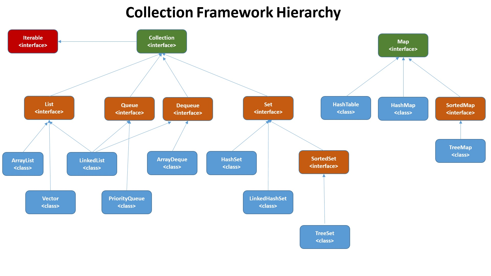

# 자바의정석 - 11장 컬렉션 프레임워크 1. List

<br>



### 컬렉션 프레임워크

: **List**, **Set**, **Map**으로 구성된 컬렉션들을 사용하기 위해 표준화된 설계

* java.util 패키지에 포함.
* jdk 1.2부터 제공

<br>

## java collection의 핵심 인터페이스 

* List(리스트)
  * 중복 허용O, 저장순서 유지O
  * ArrayList, LinkedList, Stack, Vector, Queue

* Set(집합)
  * 중복 허용X, 저장순서 유지X
  * HashSet, TreeSet

* Map(K-V)
  * Key 중복 허용X, Value 중복 허용O, 저장순서 유지X
  * HashMap, TreeMap, Hashtable, Properties
  * List, Set과 저장방식이 다르다. List, Set은 Collection 공통조상을 갖는다.


<br>

## ArrayList

: Vector 클래스의 신버전이고, vector는 하위호환을 위해 남겨둔 것이다. 기능적인 측면에서는 유사하고, List 상속받음을 나타내는 ArrayList가 권장된다.

* vector는 동기화가 되어있기 때문에 싱글스레드에서 비효율적일 수 있다.
* 배열 크기는 변경 불가능하다. 크기를 변경하려면 새로 만들어서 할당하는 방식을 사용해야 해서 필연적으로 용량 변경에는 오버헤드가 있다.
  * `trimToSize()`를 호출하면 size 만큼의 capacity로 새로운 배열을 생성해, 주소값을 변수에 할당한다. 기존 배열은 나중에 gc에 의해 제거된다.
  * 벡터의 경우 `setSize`를 호출했을 때 capacity보다 작다면 size를 늘리고 null로 채워주지만, capacity보다 크다면 위의 방법과 같이 새로운 배열을 만든다.
* 메모리상 연속적으로 데이터가 저장되어있다. 단순하게 `인덱스가 n인 데이터의 주소 = 배열의 주소 + 데이터의 크기 * n`로 인덱스 n의 원소값을 읽을 수 있다.

<br>

## LinkedList

: ArrayList는 크기 변경이 불가능하고, 데이터 추가 삭제에 많은 시간이 걸린다. LinkedList는 배열의 단점을 보완하기 위한 것이다.

* 양방향 linked list도 있다.(코틀린에서는 default가 양방향)
* (새로운 배열을 생성하지 않는다는 전제하에) 순서대로 추가 / 삭제하는 경우 ArrayList가 더 빠를 수 있다. 중간값의 경우는 LinkedList가 훨씬 빠르다.
* 데이터가 메모리상 불연속적으로 저장되어있다. 따라서, 조회 시 n번째 데이터까지 차례대로 따라가야 원하는 값을 얻을 수 있다.

<br>

## Stack, Queue

* **Stack**: 리스트의 맨 뒤 원소를 제거하는 **스택**은 **ArrayList**가 더 빠르기도 하고 적합하다. Class로 구현되어있어, 생성자가 있다.

  * 컬렉션 프레임워크 이전부터 존재하던 것이기 때문에 ArrayList가 아닌 Vector를 상속받아 구현되어있다.

* **Queue**: 첫번째 원소를 삭제해야하는 **큐**는 **LinkedList**가 적합하다. Interface로 구현되어있고 따로 생성자가 없으며 `LinkedList()`를 통해 생성해야한다.

  * https://docs.oracle.com/en/java/javase/11/docs/api/java.base/java/util/Queue.html 의 All Known Implementing Classes에서 여러가지 구현체를 볼 수 있다.
  * 실제 수행되는 메소드는 자식 클래스 `LinkedList`의 메소드들이 수행된다.

  ```java
  Stack<Integer> myStack = new Stack<>();
  Queue<Integer> myQueue = new LinkedList<>();
  ```

* PriorityQueue: 힙 구조로 이루어진 우선순위 큐]

* Deque(Double-Ended Queue): 양쪽으로 추가 삭제가 가능하다. Queue를 상속받으며, Interface이다. 구현체로 ArrayDeque, LinkedList가 올 수 있다.

<br><br>

#### Reference)

#### 자바의 정석 3판

#### https://docs.oracle.com/en/java/javase/11/docs/api/java.base/java/util/Queue.html

#### https://facingissuesonit.com/2019/10/15/java-collection-framework-hierarchy/