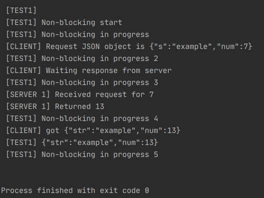

# RabbitMQ-RPC with Kotlin 이슈 및 기록

RabbitMQ를 이용해 메시지 큐 구현하기. RPC 역할   

## 201204 only Test #1
### RabbitMQ 통신에서의 Kotlin문법, Flux 사용, JSON으로 인한 주 이슈 

* Kotlin의 좋은 기능: 가변인수 vararg 

* Kotlin에서는 JSON이 불편하다. put을 사용해야하고 receiver 입장에선 JSON의 구조를 모름. 
* `server`와의 핵심 연결 역할을 하는 `convertSendAndReceive()` JSON으로 전달 안 됨. 
  * 자꾸 Null이 반환되는 이유를 겨우 찾았다.
* `sendAndReceive`는 message로 자동 convert 지원하지 않는다. 
* Kotlin -> JSON 쉽게 변환하는 방법 `""" """` 이용 
* 가변인자로 받은 경우 각각 parsing시 `as Int`, `as String` 등 명시 
* Flux가 생각보다 공부할게 많다. 
* `RabbitTemplate`가 비동기 처리를 알아서 해주는줄 알았는데 `AsyncRabbitTemplate`이 있는걸보니 아닌가보다. 

튜토리얼보다 Stackoverflow 도움을 많이 받은거같다.

-----------
Tutorial https://www.rabbitmq.com/tutorials/tutorial-six-spring-amqp.html   

## 201207 AsyncRabbit, Rabbit 차이 비교
   
Rabbittemplate만으로도 비동기처리가 가능한건가..
async를 억지로 우겨넣었지만 아직 비동기적의미가 없음. send와 receive를 분리하고, corrID를 활용하면 좋을 것 같다.

예제보고 @RabbiListener 따라하다가 헤맴. Queue name 설정하면 bind 안되는이유는?

좋은 예제 https://reflectoring.io/amqp-request-response/

https://cheese10yun.github.io/spring-rabbitmq/

https://devahea.github.io/2019/04/30/AMQ-%EB%AA%A8%EB%8D%B8%EA%B3%BC-Exchange-Queue-Binding-%EC%97%90-%EB%8C%80%ED%95%B4/

   

## 201210 rabbitMQ 연구 끝.  
#### Service와 MQ(producer)간 JSON을 주고 받는다. MQ(producer)는 Agent(receiver)에게 String 형태를 주고 Agent가 parsing해 처리한다. 

* 이슈: MQ <--> Agent role 수행하는 convertSendAndReceive()에서는 JSON 전달이 되지 않는다.  
 > JSONObject().toString()형태로 string으로 전달하면 가능하단 것을 아마 언어 숙련도가 높았다면 미리 알았을 것.  

* Test code에 Coroutine을 도입해 비동기 처리를 Test했다.  
  * RabbitTemplate 또한 Async 처리가 가능하다는 것을 얼핏 듣긴 했지만 MQ와 Agent만 생각했을 때(about Message Queue)의 이야기 같다.  
  * 또다른 비동기(Service단에서의)를 가능하게 하기 위해 Test에서 MQ에게 비동기적 Send를 보냈고 차이점을 발견했다.  
 
 ### 괄목할만한 성과 = RabbitTemplate vs AsyncRabbitTemplate 
 Service단까지 함께 Test를 함으로써 비동기적 차이가 확연히 드러남을 알 수 있었다. 
 
 Case 1) RabbitTemplate 
  
 - Test단에서의 `[TEST1] Non-blocking in progress #` 와 server단에서 `[SERVER 1] ~~~` 메시지들이  
 Client에서 `[CLIENT] Waiting response from server` 이전에 모두 수행된다. 
 따라서 Client -> Server로 `convertSendAndReceive` 를 보낸 시점에 Client는 block 되어있다는 것을 알 수 있다. 
 
 Case 2) AsyncRabbitTemplate 
  
 - Test는 Test대로, Client는 Client대로, Server는 Server대로 비동기적으로 쭉 수행된다. 
 실제 서버에서 이를 수행한다면 Client는 더 많은 일을 할 수 있긴 하다.  
 
 *그러나 실제 Client에서는 사실 RPC를 전달하는 일만 수행하면 되는데 이러한 구현이 크게 필요한가 ?*
