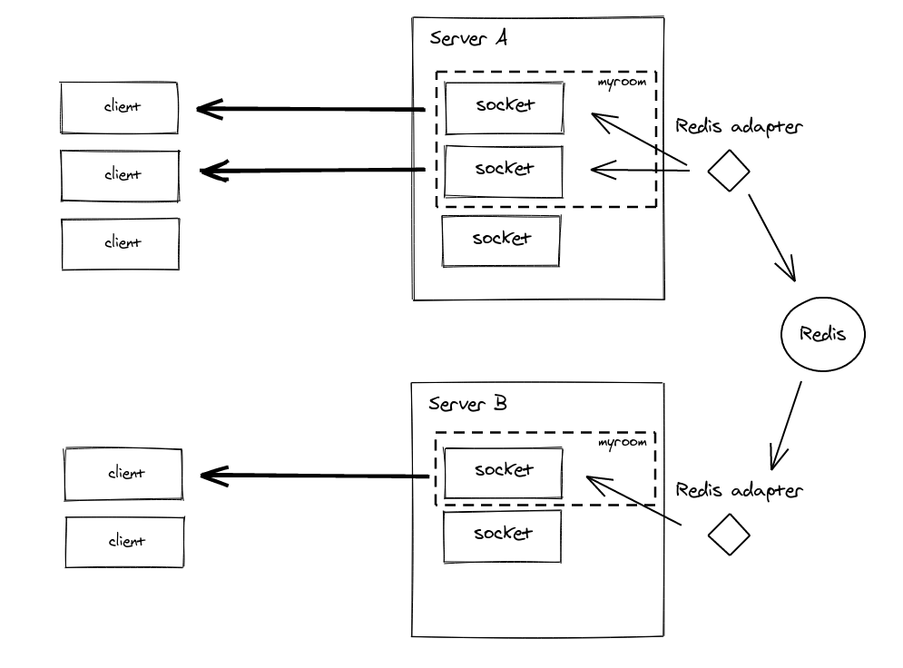

# Redis를 통해 서버 Scale out에서 자원 공유

### Scale out : 접속한 서버의 대수를 늘려 처리 능력 향상 시키는 것

: 서버의 수를 늘림. 복수의 서버를 구축해 Scale out

* **수평 확장(horizontal scaling)**
* 공유 자원에 대해 고려해야 한다.

<br>

### Scale up: 서버 자체를 증강

: 인스턴스를 더 좋은 인스턴스로 변경.

* **수직 확장(vertical scaling)**
* 비용 부담이 크다.
* e.g) EC2를 사용하다가 더 성능좋은것으로 이관하는 것.

<br>

##### c.f) 일반적으로 클라우드환경에서 **Auto scaling 한다는 것**은 트래픽에 따라 **scale out / in 한다**는 의미로 쓰인다.

<br>

### Adapter: Redis

: Redis가 어댑터로써 **서버간 브로커 역할**을 수행한다.

* 소켓서버의 특정 Room에 메시지를 보내면, Redis는 브로커가 되고 각 서버들에게 전달된다.
* 여러 서버가 redis로 연결될 때 채널 개념이 발생하고 이 채널 정보는 socket server에서 들고 있는다. 각 socket server는 메시지를 받으면 서버에서 구독하고 있는 채널에 메시지가 해당하는지를 찾고 맞으면 메시지를 해당 Room에 준다.
* Pub/Sub 매커니즘이 있다. 각 socket server는 n개의 채널을 subscribe할 수 있다.
* **Adapter 역할**
  * 일종의 cluster처럼 연결된 각 서버에 broadcast
  * routing message의 역할을 수행하는 Interface



### Redis Adapter code example

```javascript
const redisAdapter = require('socket.io-redis');

const io = require('socket.io');

socketServer = io(baseServer)
  .adapter(redisAdapter({
    host: 'redis',
    port: 6379 // default port
}));
```

<br>


## Code level example

```javascript
const redis = require('redis');

// default port 6379
const client = redis.createClient({ host: 'redis', port: 6379 });

// Unhandled Error를 방지하기 위해 아래 error 이벤트에 대한 핸들링을 꼭 해야한다.
client.on('error', (error: any) => {
  debug(error);
});
```
<br>

```javascript
client.hset(hash, key, val, (err, res) => {
    console.log(res); // 1 or 0
}

client.hget(hash, key, (err, res) => {
    console.log(res); // value
}
```

<br>

* Promisify: 위 코드를 깔끔하게 Promise로 이용하기 위해 아래와 같이 구현(이와 같이 여러 method 구현해 놓고 필요에 따라 사용)
```javascript
public set(hash: string, key: string, value: string) {
    return new Promise((resolve) => {
      client.hset(hash, key, value, (err, result) => {
        resolve(reply);
      })
    })
  }
```

<br><br>

#### Reference)

#### https://socket.io/docs/v3 <br>

#### https://socket.io/docs/v3/using-multiple-nodes/

#### Redis 로컬 설치: https://redis.io/topics/quickstart
