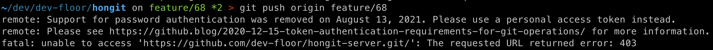
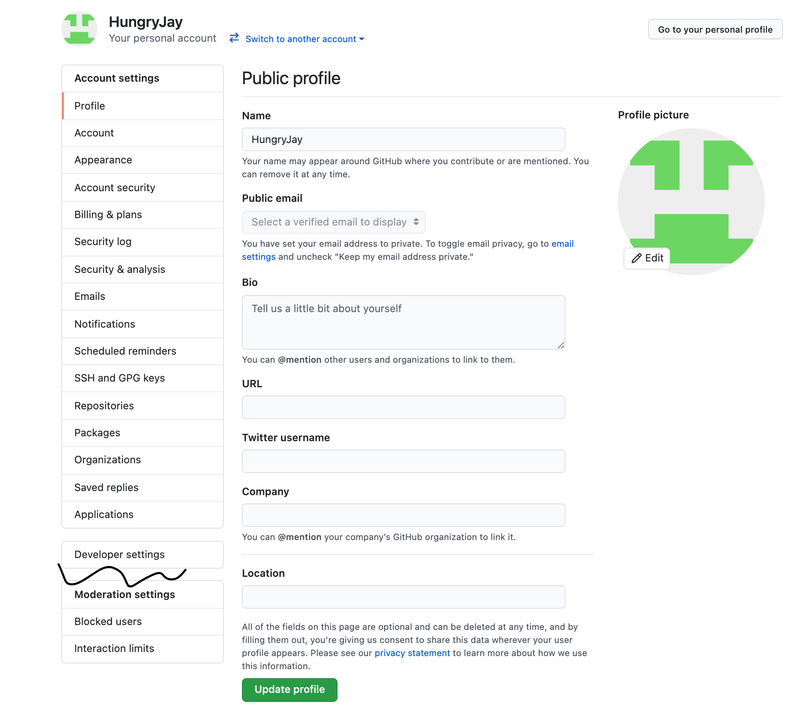
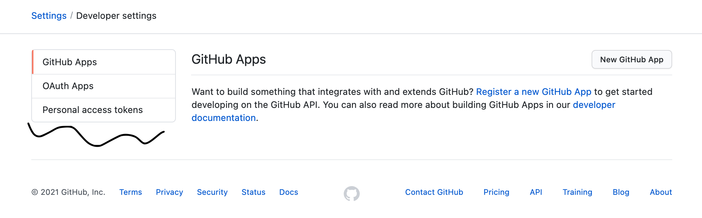
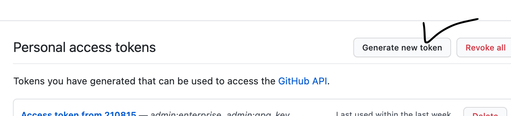
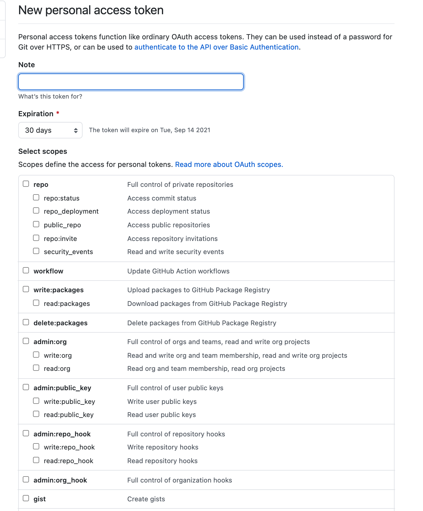
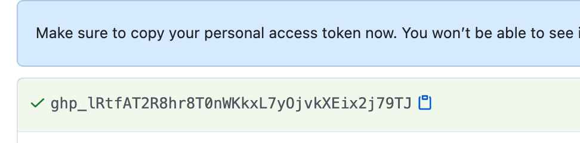
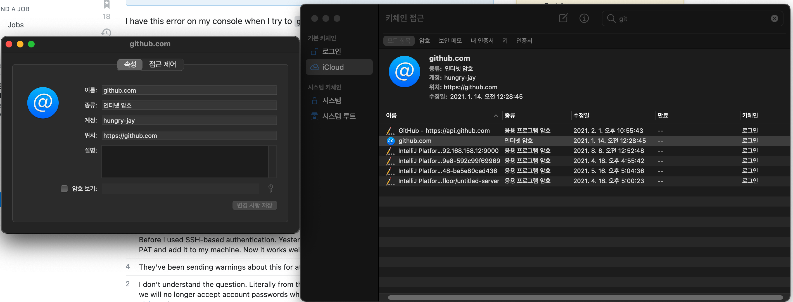

# 비밀번호 대신 PAT(Personal Access Token) 받아 사용하기

 

: 깃헙 레포지토리에 push했더니 위와같은 에러가 있었는데, 알고 보니 21년 8/13 이후로 깃헙이 더이상 비밀번호 인증방식을 사용하지 않는 것 같다.

 

## 1. 액세스 토큰 받기

1) 깃헙 로그인 후 Settings - developer settings

 

2. Personal access tokens

 

3. 토큰 생성하기

 

4. Note에 description 적어주고, expiration 기간 설정, scope는 귀찮으니 다 체크 해주면 된다.

 

* 예시용 토큰

5. 키값 나중에 필요할수있으니 갖고있기

 

!?!?!?????

  

## 2. (Mac) 키 체인 접근

https://stackoverflow.com/questions/68775869/support-for-password-authentication-was-removed-please-use-a-personal-access-to - 설명 굉장히 친절한 편

* 예전에 깃헙 계정 매번 로그인하기 귀찮아서 키체인 접근을 설정했던게 기억났다.

* 이것까지 해주면 진짜 끝.

  

#### Reference) https://stackoverflow.com/questions/68775869/support-for-password-authentication-was-removed-please-use-a-personal-access-to