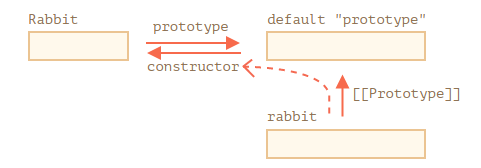

# 모던 JavaScript 튜토리얼 - Prototype

: 자바스크립트는 **프로토타입 기반 언어**이다. 모든 **객체들**이 **클래스로 정의해놓은 메소드와 속성**을 **상속**받기 위한 **템플릿**으로써 **프로토타입** 객체를 가진다.

<br>

#### Prototype

: 모든 객체들이 클래스의 정보들을 상속받을 수 있도록 **템플릿 역할**을 수행한다.

<br>

* 기본적으로 Class로 객체를 정의한다고 해도 자바스크립트 내부적으로는 프로토타입으로 관리된다.

* ES2015 클래스 구문으로 조금더 편리하게 볼 수 있도록 제공하는것

  ```javascript
  class Person {
      constructor(name, age) {
          this.name = name;
          this.age = age;
      }
      
      getName() {
          return this.name;
      }
  }
  
  // ---------------------- 위의 방식으로 class를 선언한다고해도 사실은 아래와같이 관리됨
  
  function Person(name, age) {
      this.name = name;
      this.age = age;
  }
  
  Person.prototype.getName = function() {
      return this.name;
  }
  ```

<br>

## 함수의 prototype 프로퍼티와 프로토타입 객체의 constructor 프로퍼티

```javascript
function Rabbit(name) {
    this.name = name;
}
// 기본 prototype
// Rabbit.prototype = { constructor: Rabbit };

let rabbit = new Rabbit("white rabbit");
```

* 위와같은 줄을 그림으로 표현하면 아래와 같다.

 

* Rabbit 함수에서는 `Rabbit.prototype`과 같이 Rabbit 프로토타입 객체로 접근 가능

* Rabbit 프로토타입 객체에서는 constructur 속성은 Rabbit 함수를 참조한다.

* `getName()`, `setName()` 같은 프로퍼티들이 Rabbit 함수에 추가가 되면 프로토타입에 해당 프로퍼티를 유지한다.

  * 따라서, 새로 만든 인스턴스들은 **프로토타입 원형을 복사**해 사용한다.

  ```javascript
  function Rabbit(name) {
    this.name = name;
    alert(name);
  }
  
  let rabbit = new Rabbit("White Rabbit");
  
  let rabbit2 = new rabbit.constructor("Black Rabbit");
  ```

  * 위와같은 경우 rabbit 객체의 constructor로 Rabbit 함수에 접근하는 것

<br>

## **자바스크립트는 알맞은 `constructor` 값을 보장하지 않는다.**

```javascript
function Rabbit() {}
Rabbit.prototype = {
  jumps: true
};

let rabbit = new Rabbit();
alert(rabbit.constructor === Rabbit); // false
```

* 위처럼 기본 `prototype` 값을 다른 객체로 바꾸면 이 객체에는 contructor가 없을 것..

<br>

## 깊이 이해하기

<br>

* 아래와같은 코드를 베이스로 변경하는 경우의 시나리오를 알아보기

```javascript
function Rabbit() {}
Rabbit.prototype = {
  eats: true
};

let rabbit = new Rabbit();

alert( rabbit.eats ); // true
```

<br>

### 이미 만들어진 객체에 대해서는 영향을 주지 않는다 .

```javascript
function Rabbit() {}
Rabbit.prototype = {
  eats: true
};

let rabbit = new Rabbit();

Rabbit.prototype = {}; // add this line

alert( rabbit.eats ); // true
```

<br>

### Rabbit.prototype이 참조하는 객체는 하나뿐이기 때문에 참조를 통해 객체 내용을 변경하면 다른 참조를 통해서도 변경 내용을 볼 수 있다.

```javascript
function Rabbit() {}
Rabbit.prototype = {
  eats: true
};

let rabbit = new Rabbit();

Rabbit.prototype.eats = false; // add this line

alert( rabbit.eats ); // false
```

<br>

### 객체의 프로퍼티를 제거해도 따로 변화가 없다. 그러나, 객체가 참조하는 prototype 객체를 변경하면 달라진다.

```javascript
function Rabbit() {}
Rabbit.prototype = {
  eats: true
};

let rabbit = new Rabbit();

delete rabbit.eats;

alert( rabbit.eats ); // true

delete Rabbit.prototype.eats;

alert( rabbit.eats ); // undefined
```

* 만약 rabbit에서 eats를 재정의해서 사용하고 있고, 그 때 `rabbit.eats`를 건드리면 그 객체의 프로퍼티가 변경 될 것

<br>

## 시나리오로 이해하기

```javascript
function User(name) {
  this.name = name;
}
User.prototype = {}; // (*)

let user = new User('John');
let user2 = new user.constructor('Pete');

alert( user2.name ); // undefined
```

1. `new user.constructor('Pete')`는 `user`에서 `constructor`를 찾는데 아무것도 찾지 못한다.
2. 객체에서 원하는 프로퍼티를 찾지 못했기 때문에 프로토타입 객체에서 검색을 한다. `user`의 프로토타입은 `User.prototype`인데, `User.prototype`은 빈 객체이다.
3. `User.prototype`은 일반 객체 `{}`이고, 일반 객체의 프로토타입은 `Object.prototype`이다. `Object.prototype.constructor == Object`이므로 `Object`가 사용된다.

<br><br>

#### Reference)

#### 모던 JavaScript 튜토리얼 https://ko.javascript.info

#### Node.js 디자인패턴

