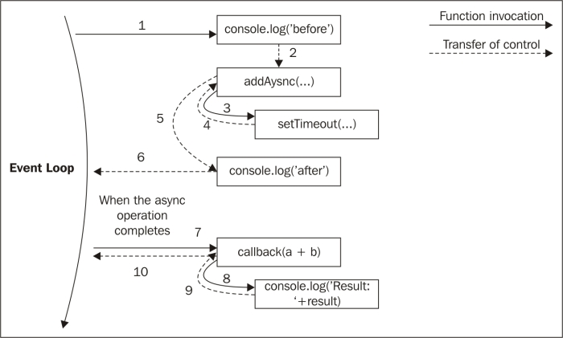

# Node.js 디자인 패턴 2장 - 1. Callback Pattern(콜백 패턴)

<br>

## 연속 전달방식

: 연산의 결과를 콜백으로 전달하는 방식

### 동기식 연속 전달 방식(Continuation-Passing Style)

: 일반적으로 아는 전달방식. **직접 스타일**

```javascript
function add(a, b) {
    return a + b;
}
```

<br>

### 비동기  연속 전달 방식

```javascript
function add(a, b, callback) {
    setTimeout(() => callback(a + b), 100);
}
```

* setTimeout은 `addAsync`로 제어를 돌려주어 제어가 호출자에게 반환된다.

 

* 호출 시점의 컨텍스트를 유지하는 것은 **Closure의 특성** 덕분

<br>

### 비 연속 전달 방식의 콜백(연속 전달 방식이 아닌 콜백)

```javascript
array1.map(element => element - 1);

// 따로 연산을 통해 callback으로 전달하는 것이 아니라, 그냥 배열의 인자를 전달
```

* 콜백이라고 항상 **CPS**나 **비동기식**이 아니다.

<br>

## Node.js 콜백 규칙

1. 콜백은 맨 마지막에, 오류는 맨 앞에

   ```javascript
   fs.readFile('foo.txt', (err, data, callback) => {
       if(err) handleError(err);
       else {
           callback(data);
       }
   })
   ```

   * 가독성 측면에서 좋음. err가 있으면 첫번째 인자가 Error라고 판단

2. 오류 전파

   * 일반적으로 비동기식 CPS에서 오류를 callback으로 전달하여 수행
   * 오류를 전달할 때는 `return callback(err)` 처럼 사용해 early return

3. **캐치되지 않는 예외**

   * `uncaughtException`은 어플리케이션의 **일관성을 보장할 수 없게 만든다**. **비동기 콜백 내부**에서 예외를 발생시키면, 그 예외는 **이벤트 루프로 이동**한다.

     ```javascript
     ...
     
     try {
         const parsed = JSON.parse((err, data) => {
             ...
         });
     } catch { // Error catch
         return callback(err);
     }
     
     ...
     ```

     * 위의 예에서 만약 `try... catch` 구문이 없고 `JSON.parse` 에서 에러가 발생한다면, 예외가 그대로 **이벤트 루프**로 이동하고 다음 콜백으로 전파되지 않는다.(위의 그림 참고)
     * 제대로 된 예외를 받고자 한다면, **예외가 발생한 스택**과 **실행 스택**이 같아야한다. 즉, 위와같이 에러가 발생할만한 비동기 코드 내부에서 `try catch` 로 감싸야 한다.
       * 위의 예시를 기준으로, **`try ... catch ` 스택과 `parse((err, data) => { })`의 스택은 별개의 스택**


   * 그런데, `uncaughtException`이 만약 발생한다면, 어쨌든 어플리케이션을 종료하도록 처리하는 것이 좋다.

     #### 210906 추가

     * 테스트 코드 작성 중

     ```typescript
     // 아래와 같은 테스트가 실패한 이유
     expect(await funcThrowException()).to.be.rejectedWith(..);
     
     // 이렇게 보면 편하다.
     expect(
         // ..
         await funcThrowException
         // .. 
     ).to.be.rejectedWith(..);
     ```

     * `await` 키워드를 만나는 시점에 백그라운드로, 이후에 queue로 들어가지만 다시 call stack에 들어간 시점에 `funcThrowExecption`에서 던진 에러를 어디에서도 받지 못한다.
     * 바깥의 블락(`expect ... to.be.rejectedWith`)에서 `try ... catch`로 감싸주면 에러를 잡을 수 있게 됨

<br><br>

#### Reference) Node.js 디자인패턴