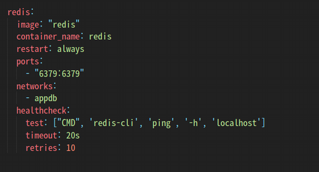
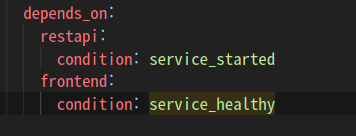
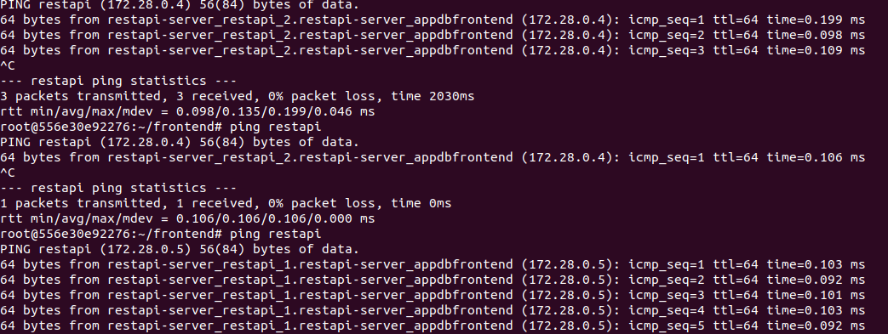
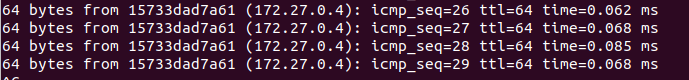
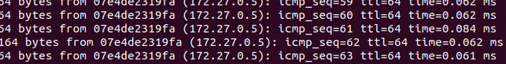
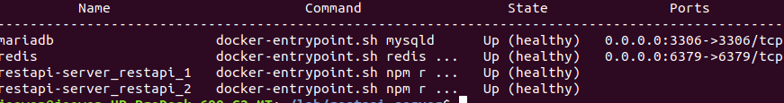

# Docker를 통해 LB / REDIS로 scaled-server 리소스 공유

## docker compose

  
* docker compose 환경설정 변경 
  

  
*depends_on -> restapi와 frontend가 해당 condition을 먼저 만족해야 해당 환경 실행* 
  

## Load Balancing
  
 * ping restapi의 결과: 0.4와 0.5 ip를 왔다갔다 하는걸 볼 수 있음 - load balancing
    * 해당하는 4,5는 각각 하나의 restapi 서버들임 
  

  

  

  
 * $ docker-compose ps 결과 
 
