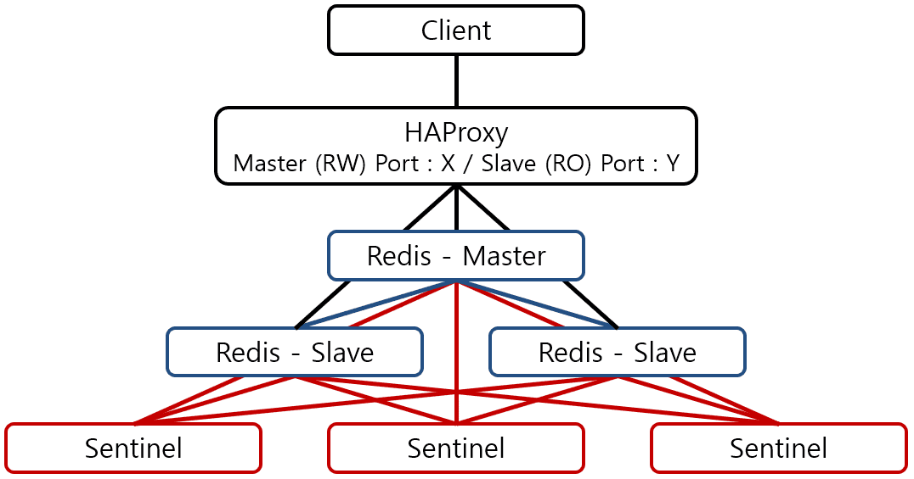
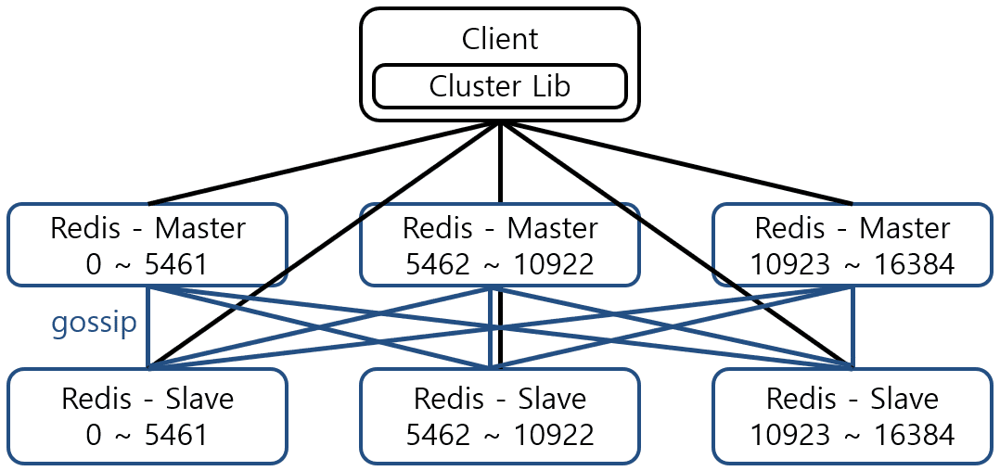

# Redis Replication / Cluster와 Sentinel

## 배경

- 언제사용?
    - 물리 머신이 가진 메모리보다 더 많은 데이터를 저장해야 할 경우
    - Failover를 통해 **HA**(high availability)를 보장해야 할 경우
- Redis master-slave(using sentinel) vs Redis cluster

## 1. Master Slave(Replication)

- Master : slave = 1 : n 가능
    - 마스터는 Read Write, 슬레이브 Read Only
    - `replica-read-only`를 사용해서 슬레이브 RO / RW 설정 가능
    - 이 때 RO / RW 정보를 Client가 알아야하는데, 이 때 **HA Proxy**를 사용
- Master는 Data 변경시 변경 내용을 backlog에 기록하고 slave는 backlog 를 바탕으로 replication.
    * HA시에 데이터를 유지하려면 persistence 기능을 사용해야 한다.
    * 디스크에 저장하거나 `repl-diskless-sync`로 디스크를 사용하지 않고 동기화 가능
      * 요청을 받는 프로세스가 아닌, 별도의 자식 프로세스를 통해 복제가 이루어지기 때문에 이것이 성능에 영향을 미치지는 않음.
- Master가 죽으면 slave가 master에게 주기적으로 connection 요청
    - 복구 가능 - Master 살아나고 slave는 replication 수행해 Master와 동기화
      - 살아날 때 까지 기다리면 성능 저하
    - 복구 불가 - Slave중 하나를 master로 승격, 기존의 master를 slave로 강등(**Sentinel** 방식)

## 2. Sentinel

- 위의 Replication 방식에서 Master의 downtime은 redis cluster의 가용성을 저하(그 동안 write 동작 수행 불가하기 때문), sentinel방식은 이를 해결해줌.
- 주로 Replication보다 더 효율적으로 HA를 얻고자 할 때 사용
- HA 정책만 다르고 Replication과 마찬가지로 Master는 RW / Slave는 RO
    - **HAProxy 이용**
- **HA** : Redis 관리자 간섭 없이 자동으로 failover
- redis와 별도로 여러 Sentinel process.(fail over를 위해 보통 최소 3개, 홀수 개)
    - 홀수 개수로 split brain(additional master)를 방지
      - Kafka에서의 정책과 같음(투표 동률 방지)
    - 2개 이상으로 SPOF(Single point of failure) 방지
      - **SPOF**(단일 장애점): 한 노드로 구성되어있는 시스템에서 이 노드 오작동으로 전체 시스템 중단을 야기

## HAProxy

- master RW(Read/Write), slave RO(Read only) 이기 때문에 client는 각각의 IP, Port를 알고 적절히 붙어서 동작을 해야한다.
- 따라서 master 교체상황에서 client의 redis 설정 또한 변경. → 일일히 계속 바꾸는것은 쉬운 일이 아니기 때문에 **HAProxy** 이용.(HAProxy가 **tcp-check**로 주기적으로 master, slave 동작 파악)
- HAproxy는 client에게 redis의 master, slave에 일정하게 접근 할 수 있는 end-point를 제공.

---

---

## 3. Redis Cluster

- 주로 **대용량 트래픽을 감당해야 할때 데이터를 나누어 저장**

    - Redis에서 제공하는 replication 중 **샤딩**을 이용한 메커니즘.
    - Sentinel과는 다른 용도로 사용됨

- 각 redis는 다른 모든 redis들과 직접 연결하여 **gossip protocol**을 통해 통신. → Multi-master, multi-slave.
  
    - client 또한 모든 redis와 직접 연결해 data 주고받음.
    
- gossip Protocol 기본 port는 16379 → (Redis보다 10000 높은 번호를 사용)

- 각 master는 **Hash Slot**이라는 data 저장구역을 다른 master와 나누어 소유.(위 그림은 hash slot을 3개로 균등 분할해 구성한 모습)
    - CRC16을 이용해 16384개의 슬롯 균등 분배
    - 운영 중단 없이 Hash slot 다른 노드로 이동 가능
    
- 각 Master에 할당된 hash slot은 redis 관리자에 의해 동적으로 변경 가능
    - Master와 Slave 추가삭제 또한 동적으로 가능
    - 위 그림은 1:1이지만, Slave 추가를 통해 Master : slave = 1 : n 가능
    
- Client는 cluster에 포함된 아무 redis에게 요청을 보냄.
    - **처리 가능할 경우 - redis에선 처리 가능한 요청은 처리**
    - **처리 불가할 경우 - 처리가능한 redis의 정보를 client에게 전달.**
        - e.g. slave에게 write를 보내면 해당 slave는 처리가능한 master redis 정보를 client에게 전달 하고 redirection
    
- master 죽을 시 slave는 gossip Protocol을 통해 master의 죽음을 파악한 뒤 스스로 master로 승격. → 이 때 replication은 async이기 때문에 죽음으로 **data** **정합성**이 깨질 수 있다.
    - 깨진 정합성으로 인해 data 충돌이 발생할 경우 **무조건** 나중에 master가 된 data 기준으로 정합성을 맞춤.

    

    

    #### References

    #### [https://redis.io/topics/cluster-tutorial](https://redis.io/topics/cluster-tutorial)

    #### [https://www.letmecompile.com/redis-cluster-sentinel-overview/
    
    #### [http://redisgate.kr/redis/configuration/replication.php#diskless_replication](https://www.letmecompile.com/redis-cluster-sentinel-overview/)
    
    #### [https://goodgid.github.io/Redis-Master-Slave-and-Cluster/](https://goodgid.github.io/Redis-Master-Slave-and-Cluster/)
    
    #### [https://medium.com/garimoo/redis-documentation-2-레디스-클러스터-튜토리얼-911ba145e63](https://medium.com/garimoo/redis-documentation-2-%EB%A0%88%EB%94%94%EC%8A%A4-%ED%81%B4%EB%9F%AC%EC%8A%A4%ED%84%B0-%ED%8A%9C%ED%86%A0%EB%A6%AC%EC%96%BC-911ba145e63)
