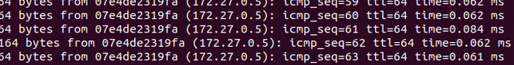

# Scale-out-with-redis

## Scale out : 접속한 서버의 대수를 늘려 처리 능력 향상 시키는 것

- 서버의 가상화 기능을 사용
- 가상적으로 복수의 서버를 구축해 Scale out
- Sharding, queue, **In memory,** NoSQL, ...
- 분산처리, 병렬처리 등

### ↔ Scale up: 서버 자체를 증강

*c.f) Auto scale*

## Redis

- In memory data store
    - Disk 참조 X → 작업량 향상, 속도 향상
- 유연한 Data structure
    - 다양한 Data 유형(문자열, 목록, 세트, 해시 비트맵 등)
- 단순성(간결함)
- 확장성 및 가용성
- 상기 특성 덕에 **In memory cache 구현**에 적합

#### Reference
Redis 설치 https://redis.io/topics/quickstart


## redis logic

```
const redis = require('redis');

const client = redis.createClient({ host: 'redis', port: 6379 });

client.on('error', (error: any) => {
  debug(error);
});
```
<br>

```
client.hset(hash, key, val, (err, res) => {
    console.log(res); // 1 or 0
}
```

<br>

```
client.hget(hash, key, (err, res) => {
    console.log(res); // value
}
```

<br>

* 위 코드를 깔끔하게 Promise로 이용하기 위해 아래와 같이 구현(이와 같이 여러 method 구현해 놓고 필요에 따라 사용)
```
public set(hash: string, key: string, value: string) {
    return new Promise((resolve) => {
      client.hset(hash, key, value, (err, result) => {
        resolve(reply);
      })
    })
  }
```
          
<br>

## docker compose
 <br>
* docker compose 환경설정 변경<br>
 <br>
 
 <br>
*depends_on -> restapi와 frontend가 해당 condition을 먼저 만족해야 해당 환경 실행*<br>
 <br>
 
## Load Balancing
 <br>
 * ping restapi의 결과: 0.4와 0.5 ip를 왔다갔다 하는걸 볼 수 있음 - load balancing
    * 해당하는 4,5는 각각 하나의 restapi 서버들임<br>
 <br>

 <br>
 
 <br>
 
 
 <br>
 * $ docker-compose ps 결과<br>
<br>
