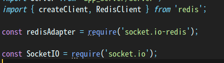
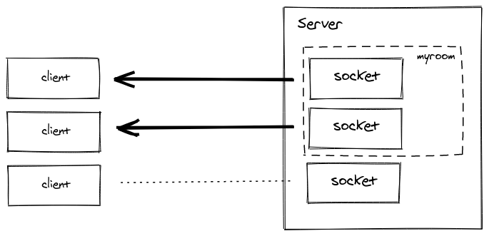

# socket.io-redis

## 양 방향 통신
이전에는 Polling, Streaming 방식 등 여러 방법을 통해 양 방향 통신을 구현
* 브라우저마다 각각 구현이 달라 개발이 복잡하고 어렵다.
<br>

## Web Socket
* 서버와 클라이언트간 양방향 통신환경 제공해주는 실시간 통신 기술 <br>

* port: 80을 통해 웹 서버 연결하므로 추가적인 방화벽이 필요하지 않음(?) <br>

* 소켓을 이용해 데이터를 주고 받음 <br>

* `http://` → `ws://` <br>

* 다양한 서버 구현체가 있음 <br>
<br>


## Socket.io

* Web socket 처럼 클라이언트, 서버간 양방향 통신을 가능하게 해주는 모듈 <br>

* javascript 이용, 서버 Node.js가 지원 <br>

* 통신을 시작할 때 각 브라우저에 대해 websocket, pooling, streaming, flash socket 등에서 가장 적절한 방법을 찾아 보내줌. <br>

* socket.io를 통해 개발하면 websocket이 지원되지 않아도 양방향으로 주고받을 수 있음 <br>

* 그렇다고 socket.io != websocket이다. 따라서 socket.io 클라이언트와 websocket 서버는 연결이 안된다. Vice versa <br>

* 기존 사내 restapi 서버에서 쓰던 방식

`socket.emit()` - 이것을 통해 event를 보낸다(client에게) <br>

 `socket.on(<event name>, <listener>)` event가 도착하면 listener를 통해 받는다.(callback처럼) <br>
 
 * 관련 모듈
 
 <br>
 
 * redisClient, redis + socketIO(adapter)
 

- 전체(broadcast)

    `socketServer.emit(eventName, data);`

- Namespace

    `socketServer.of(nameSpace),emit(eventName, data);`

- 특정인

    `socketServer.to(socketID).emit(eventName, data);`

- 특정 방 입장

    `socket.join(roomID)`

- 특정 방 전체에 event 전달

    `socketServer.io(roomID).emit(eventName, data);`

    or

    `socket.broadcast.to(roomID).emit(eventName, data);`


<br>

### Room

소켓이 `join` 과 `leave` 를 할 수 있는 임의의 채널이다. 소켓을 통해 client들에게 event를 broadcast할 수 있다.<br>
  *이 때 client의 입장에선 room 들에 대한 정보를 모른다.(사실 서버쪽에서만 신경 쓸 일)*
<br>



`io.to(‘some room’).emit(‘some event’);`

이러한 방식으로 사용된다.

`io.to(‘room1’).to(‘room2’).to(‘room3’).emit(‘some event’);`

이 때 방 안의 모든 sender들이 event를 받게 된다.

<br>


* Broadcast data
```
io.on('connection', async (socket) => {
  const userId = await fetchUserId(socket);
  socket.join(userId);
  // and then later
  io.to(userId).emit('hi');
});

```
<br>

### Adapter: Redis
socket instance와 room간 관계를 저장하고, 연결된 모든 clinet에게 broadcasting을 가능하게 한다.<br>

scale out에서 redis가 효과적

- Adapter 역할(기존 restapi 에서의 방법)
    - 일종의 cluster처럼 연결된 각 서버에 broadcast 하는 방식
    - routing message의 역할을 수행하는 Interface
    - socket과 room간 관계를 저장함
    - Redis와의 adapting을 통해 broadcasting 기능이 가능


- Pub / Sub 기능 통해 수행(현재 restapi의 방법)
    - 각 서버들은 하나의 channel을 subscribe
    - 메시지를 보낼 서버가 publish를 하면 각 서버는 메시지를 받는다.

```
const redisAdapter = require('socket.io-redis');

const io = require('socket.io');
```

```
socketServer = io(baseServer)
  .adapter(redisAdapter({
    host: 'redis',
    port: 6379
}));
```


### reference <br>
https://socket.io/docs/v3 <br>
https://socket.io/docs/v3/using-multiple-nodes/
