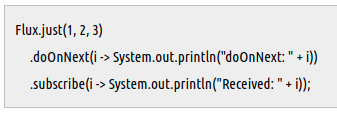

# Reactive programming

Data == Stream / event / signal / sequence 로 보며, Asynchronous하게 데이터 전달하는 방식의 Programming

 

## Reactive Streams

* non-block 비동기를 제공한다.
* Reactive streams에서 **Backpressure**은 비동기의 경계를 명확하게 하고, **stream data 교환**을 효과적으로 처리하도록 한다.
* Reactive Stream의 구현체가 바로 Webflux에서의 **Reactor**이다.
  

### Backpressure란 (→ dynamic pull 방식 이용)

- 상위 컴포넌트에게 본인(컴포넌트) 장애 발생을 알리고 load를 줄인다. → load를 분산처리해 시스템 복원력을 높인다.

1. push 방식
* publisher가 subscriber에게 데이터 push하는 방식.
* subscriber의 상태를 고려하지 않고 보낸다. 때문에 subscriber의 처리 속도가 낮다면, out of memory 발생 우려 있다.

2. pull 방식
* subscriber가 처리할 수 있는 만큼 publisher에게 요청. 따라서 out of memory 에러 발생하지 않는다.
	- Dynamic pull: subscriber가 8개 처리하고 있고, 2개 더 처리 가능할 때 2개 더 publisher에게 요청
   

### Reactive Streams API 흐름 

1. `Subscriber` 가 `subscribe`를 통해 `Publisher`에게 구독 요청
2. `Publisher`가 `onSubscribe` 메서드를 통해 `Subscriber`에게 `Subscription` 전달
	- 전달이 완료되면, `Subscription`은 양 측을 연결하는 매체가 됨
3. `Subscription`을 통해 `Subscriber`는 `Publisher`에게 `request`함수로 요청하고, `Publisher`는 `Publisher`에게 `onNext`로 전달
	- 성공 시 `onComplete`, 에러 시 `onError`
4. 이를 통해 연결을 통해 통신을 주고받는 것이 Backpressure.
  
_publisher를 이용해 stream 정의, 
Subscriber를 이용해 발생 stream 처리, 
subscriber가 publisher로부터 stream을 Subscription(구독)받음_
  

### Reactor에서 가장 중요한 component(둘은 모두 publisher)
1. mono
- 0 ~ 1개 데이터(next 신호) 전달
- 1개 초과시 flux로 변경 가능
2. flux
- Data의 흐름 단위.
- 0 ~ N 개 데이터 전달

### 구독과 신호 발생

- sequence는 바로 신호를 발생하지 않는다. **구독** 시점에 신호 발생

    

- doOnNext() 메서드는 Flux가 Subscriber에 next 신호 발생할 때 호출 됨

    

⇒ 따라서 위의 두 결과 모두 "doOnNext: "와 "Received "가 번갈아가며 1, 2, 3 순으로 수행

- subscribe() 시점에 신호 발생

### Cold seq vs Hot seq

- 데이터 생성 시점이 다름.
    - Cold: 구독 시점(위의 예제가 cold)
        - e.g) API 호출(구독 때마다 새로운 요청을 server에 전송)
    - Hot: 구독자가 있건 없건 데이터 생성
        - e.g) 센서 데이터. 계속 데이터는 생성 되고 있음. 구독 후 부터 센서가 받음.

#### References
https://javacan.tistory.com/entry/Reactor-Start-1-RS-Flux-Mono-Subscriber  
https://engineering.linecorp.com/ko/blog/reactive-streams-with-armeria-1/  
https://www.nurinamu.com/dev/2020/04/09/why-webflux-1/
